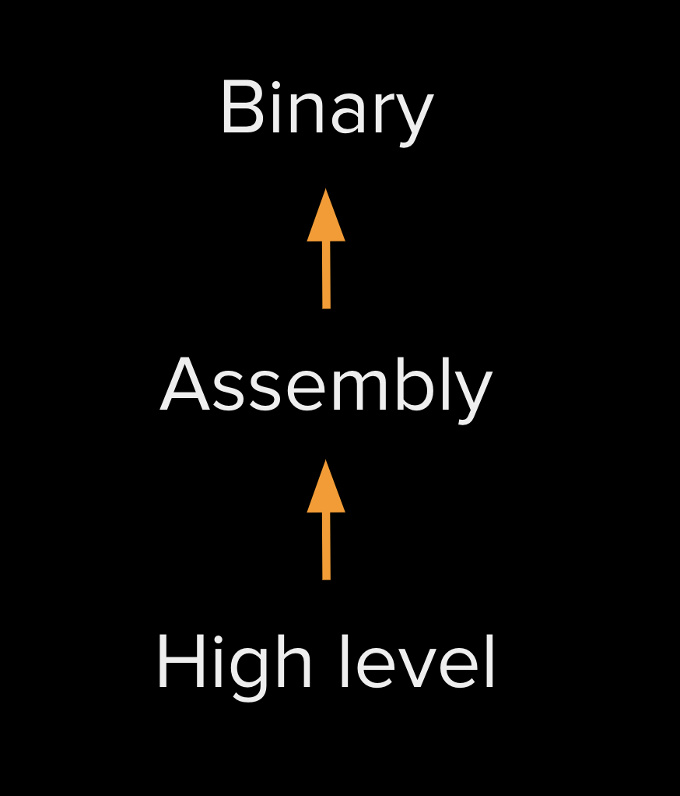

## Why web assembly
With the rise of the internet almost every personal computer has a web browser and with it, a powerful standardized platform which Frontend Engineers use to build and create using JavaScript, HTML, and CSS. Over the past few years, non-frontend engineers have increasingly wanted to utilize the browser to build and create but were limited because to work on the frontend you have to know JavaScript.

Web Assembly bridges that gap and allows languages like C and Rust to be compiled into a language that the browser understands and works in _tandem_ with JavaScript.

-- Runs at near native speed\
-- Is memory safe\
-- Designed to run on many platforms, not just the browser
