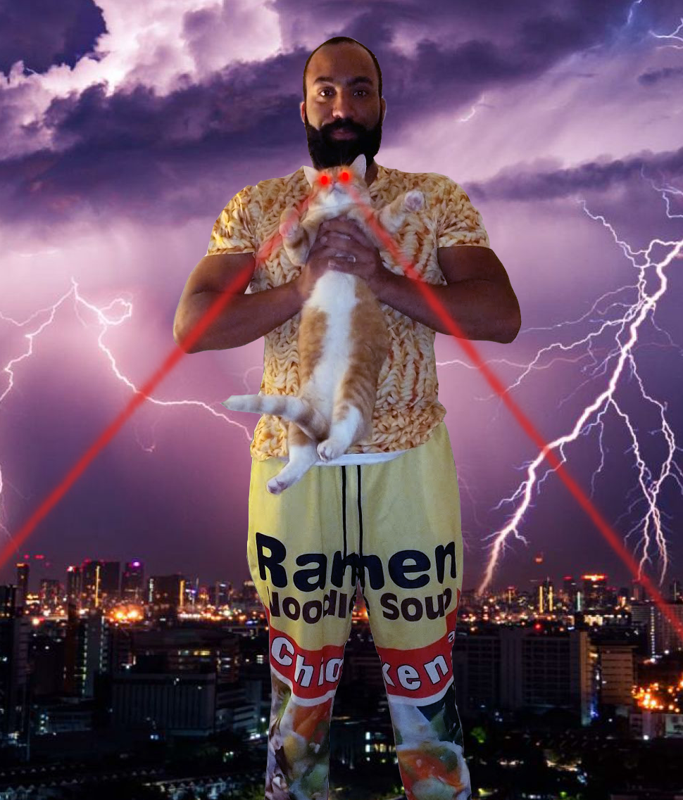

Hello! My name is Jem Young and I'm very excited to go on a journey with you with Introduction to Web Assembly. By the day I'm a Senior Software Engineer at [Netflix](https://www.netflix.com) where I work on growth infrastructure. At night I'm a father, husband, co-host on the [Frontend Happy Hour](https://frontendhappyhour.com/) podcast, instructor on [Frontend Masters](https://frontendmasters.com/teachers/jem-young/) and in my "free time" I really enjoy [giving talks](https://www.youtube.com/watch?v=qouPzSryggk) on engineering and code.

[Twitter: @jemyoung](https://twitter.com/jemyoung)

[LinkedIn](https://www.linkedin.com/in/jemyoung/)

### Other courses on Frontend Masters
[Fullstack for Frontend](https://frontendmasters.com/courses/fullstack-v2/)

[Interviewing for Front-End Engineers](https://frontendmasters.com/courses/interviewing-frontend/)
