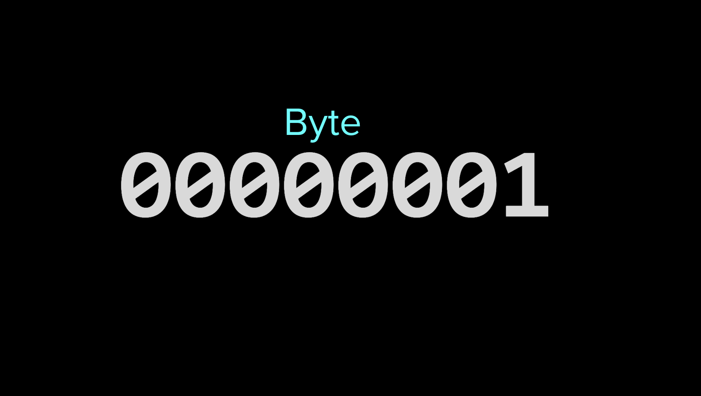
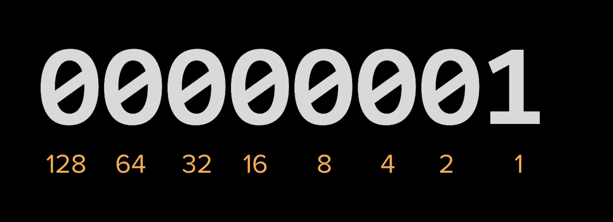
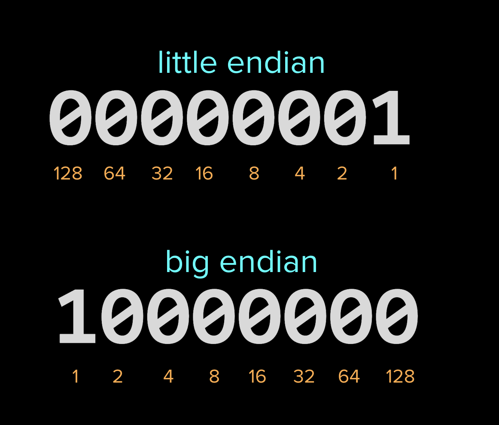

A bit (binary digit) is the smallest unit of information in computing.

A group of of 8 bits is called a byte.

Using only 1 and 0 means that we use a Base 2 (**bi**nary) counting system in computing. That is, in any given position there are only two options: 0 or 1. Compare this with our everyday Base 10 (**deci**mal) system where any given position can be 0-9.

#### Counting
In Base 2,\
 20 = 1,\
  21 = 2,\
  22 = 4...

`00000001` = 1\
`00000011` = 3\
`10100001` = 161

#### Endianness
When computers interpret instructions they need to know the byte order known as endianness. When the leftmost bit represents the largest value this is known as _little endian_. When the rightmost bit is the largest value is known as _big endian_.

Web Assembly reads and writes instructions in [little endian](https://webassembly.github.io/spec/core/syntax/instructions.html#memory-instructions) byte order.
