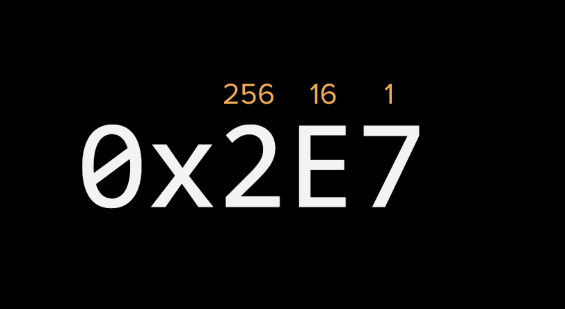

The phrase _machine code_ is often used when describing low-level programming and it conjours images of engineers reading pages of ones and zeroes. In reality, most humans would be unable to follow endless blocks of ones and zeroes thus _hexadecimal_ serves as an intermediate step: concise enough for machines but readable enough for humans and is the lowest level programming language.

> Note: I don't expect you to memorize how to read hexadecimal. This is more of an FYI because Web Assembly error and opcodes are often presented in hex.

Hexadecimal uses Base 16 for calculating byte values and the letters A through F represent the numbers 10 through 15 respectively.

| Decimal      | Hexadecimal |
| ----------- | ----------- |
| 0      | 00       |
| 1     | 01       |
| 2      | 02       |
| ..      | ..       |
| 9      | 09       |
| 10      | 0A       |
| 11      | 0B       |
| 12      | 0C       |
| 13      | 0D       |
| 14      | 0E       |
| 15      | 0F       |
| 16      | 10       |
| 17      | 11       |
| 18      | 12       |

`2E7` = 743\
(**256** * 2) + (**16** * 14) + (**1** * 7) = 743

Confused? Totally ok! The first time coming across hex may seem a bit daunting but it's easy to see the advantage of hex when it comes to brevity and readabilty as compared with binary.

`1A7` = 423\
`110100111` = 423

I've found this [site](https://www.bbc.co.uk/bitesize/guides/z3fgcdm/revision/2) by the BBC useful for understanding hexadecimal.

#### Exercise

  
What number does 1F7 represent?

`503`\
(**256** * 1) + (**16** * 15) + (**1** * 7) = 503

> Note on the origins of Hexadecimal:\
An 8 bit byte can be split into 2 * 4 bit "nibbles".\
\
For example:
`11001011` can be split into
`1100` and `1011`
\
Each 4 bit nibble is a number between 0 & 15 (a single hex digit).
\
\
So a byte of 8 bits (that are difficult to remember and prone to errors if copying from a book) can be represented in 2 hex digits (easier to remember when copying from a book).
\
\
It came about when early computer engineers had to write down binary codes (before printers even) and so many errors crept in that they realised they had to come up with a method that would reduce the number of errors that would occur.
\
\
So 2 hexadecimal digits are just a convenient way (or shorthand even) to represent an 8 bit binary byte.
\
via [Simon Cobb](https://www.simoncobb.co.uk)
