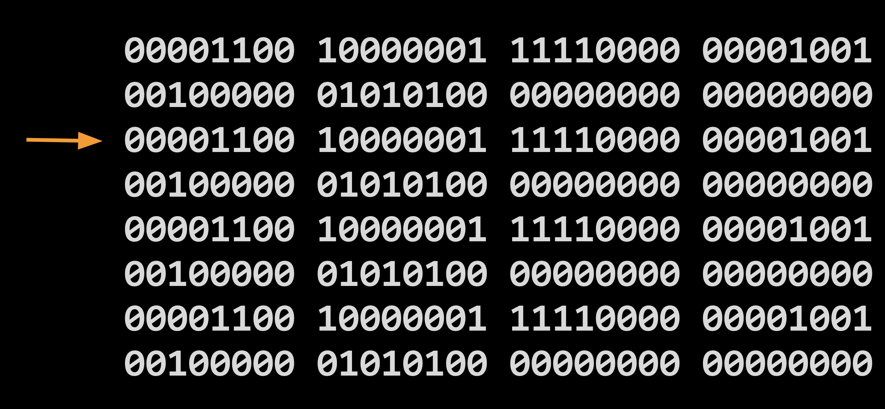

Computer processes are inherently stateless. That is, all those 1's and 0's flying around are lost once the power is turned off so all computers use some form of memory in order to save information and keep track running processes. There are many forms of memory from L1 caches on processors to solid state drives (SSD) for long-term data storage to random access memory (RAM) used by the operating system to store and access short-term data.

For a high-level language like JavaScript we generally don't spend too many calories thinking about memory since JavaScript has garbage collection meaning that when we need to create a string or an object, the engine automatically allocates and deallocates memory for us. In a lower level language like Web Assembly we have to be explict about where in memory we're reading and writing data to.

#### Structure
Think of memory as a giant warehouse full of storage bins. Each bin has an address and can have anything inside it so long as it fits within the bin. Processes can request bins for any purpose and it's up to the operating system to allocate the bins, remember which bins are in use, and make sure others processess can't peek into other bins.

Generally speaking, only the process itself knows the contents and ordering of the data in the bin so we can't access the contents directly. We only know the address and size of the data. In programming we use the concept of _pointers_ (the address of the bin) to read and write from memory.

