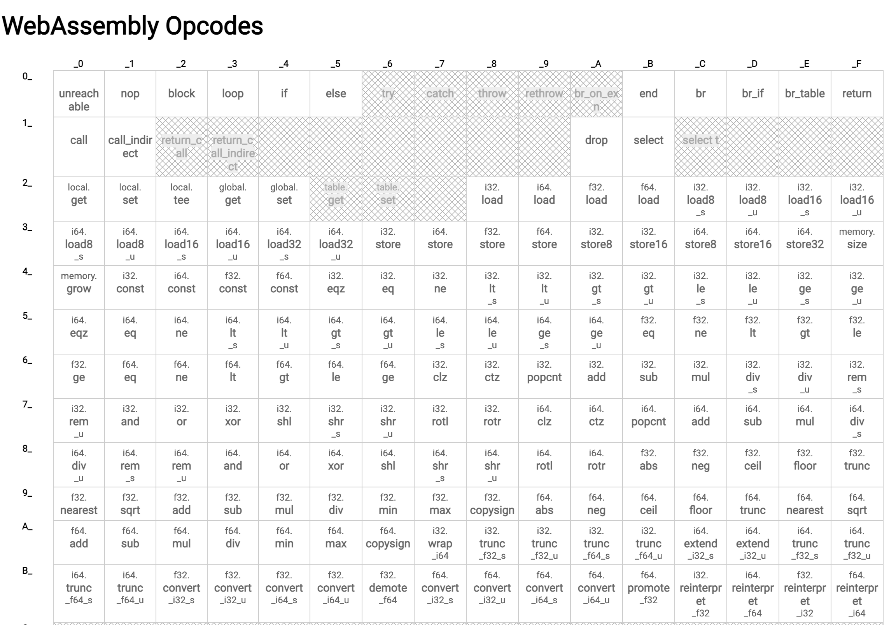

#### Stacks

A stack is memory region where variables are stored and accessed by the running program. Once execution is complete the stack is cleared.

> While similar in concept, a Stack is data structure that stores information in Last In First Order (LIFO) and is not the as an execution stack.

Web Assembly is stack based language so all operations read and write to the stack in a linear fashion.

> You've probably heard of the call stack in JavaScript which is a reserved portion of memory the interpreter uses to keep track of running functions.

#### OpCodes

Opcodes (Operation Code) are readable computer instructions representing machine language instructions.


[Here is an interactive table](https://pengowray.github.io/wasm-ops/) of current Web Assembly OpCodes.



OpCodes are specific to the data type. We're going to stick with 32-bit integers for this course.

| Type      | Name |
| ----------- | ----------- |
| i32      | 32-bit integer  |
| i64      | 64-bit integer  |
| f32      | 32-bit float       |
| f64      | 64-bit float       |
-----------
#### Instruction stack
All Web Assembly instructions read and write from the stack. Think of the stack like a JavaScript array where values are pushed and popped to and from the stack. For example,  `i32.mul` pops two `i32` values from the stack and multiplies them together.

```wasm
get_local 0 ;; push first parameter onto the stack
get_local 1 ;; push second parameter onto the stack
i32.mul ;; pop both values and execute operation
```

To push a value onto the stack use the `i32.const` instruction
```wasm
i32.const 99 ;; push 99 onto the stack
```

#### Exercise
<details>
  <summary>Create a "minusone" function that takes an i32 and substracts 1</summary>

```wasm
(module
  (export "minusone" (func $minusone))
  (func $minusone (param $x i32) (result i32)
      get_local $x
      i32.const 1
      i32.sub
  )
)
```

<iframe src="https://webassembly.studio/?embed&f=nv688an8wxd" style="width:100%; height:500px; border:0; border-radius: 4px; overflow:hidden;" sandbox="allow-modals allow-forms allow-popups allow-scripts allow-same-origin"></iframe>

</details>
