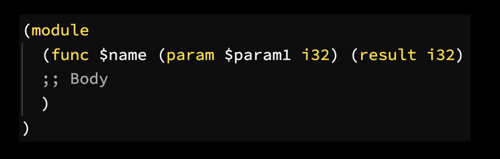

The fundamental unit of code is a module. Within the module, we create functions to export which can be called by JavaScript. Function parameters are known as _locals_ and we access them with either `get_local` or `local.get`.



> A Web Assembly module is a tree-based structure known as an [S-expression](https://developer.mozilla.org/en-US/docs/WebAssembly/Understanding_the_text_format#s-expressions). Just thought you'd like to know.

#### Web Assembly Studio
We're going use [Web Assembly Studio](https://webassembly.studio/) to write our first [hello world](https://webassembly.studio/?f=a8z71cwsulu).

Our function will take a 32-bit integer as input and return the input unmodified.
```wasm
;; main.wat
(module
  (func $helloWorld (param $num1 i32) (result i32)
    get_local $num1
  )
  (export "helloWorld" (func $helloWorld))
)
```

 Notice that a function implicitly returns the last item in the stack. To execute our wasm, click "build and run" to see the output of our hello world function.

Before we can build anything more complex there's two concepts we need to learn: stack and OpCodes.
