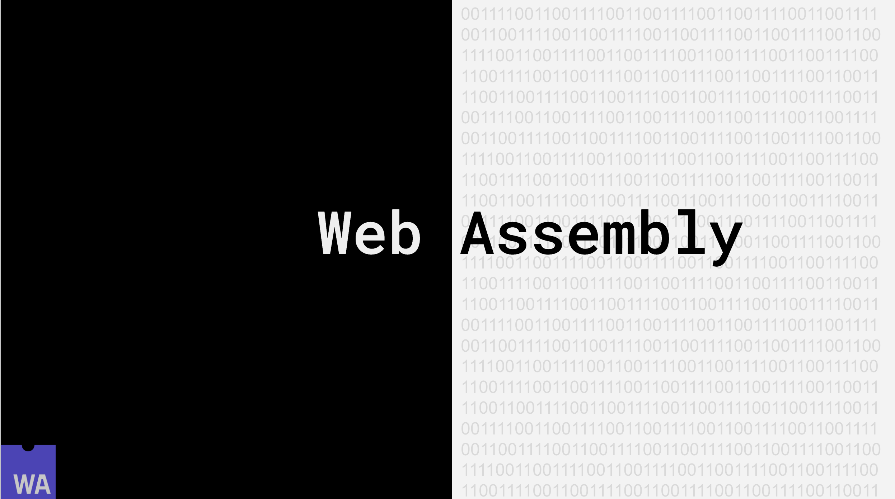

Web Assembly (wasm) is a powerful low-level language that is meant to be a compile target for high-level languages. It is designed to be portable and ran in many different environments. It is designed to _compliment_ JavaScript, not replace it.

Web Assembly runs in its own environment at near native speed, can be cached, and runs much faster than JavaScript can be parsed.

Let's walk through a simple example of a wasm function.
